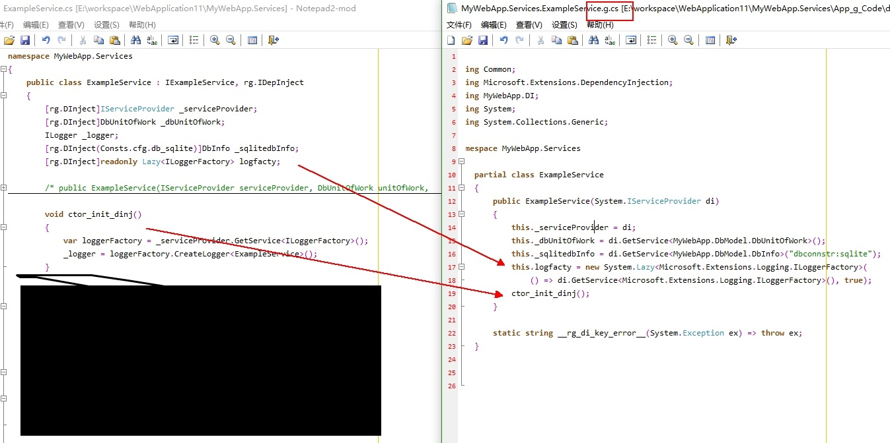
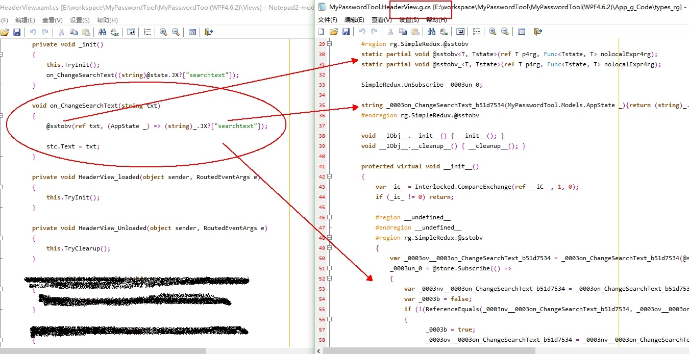

# rg
什么是rg？ 全称 Roslyn Generation , 首字母缩写刚刚好是中文某个词缩写。。。
Roslyn是按下vs2017+ 的f5后的核心操作，利用该核心可linq任意c#项目中的特定代码，然后根据这些代码infos编写出脚本，
该脚本能在编码后按f5前进行一些计算来生成新的代码。
这个脚本不需要修改原项目，运行时不需要vs，只依赖.netcore。

详情请看[sample目录](./sample)

备份地址：（度盘）/s/1m5qWdeuwPHRt26Efs--B4Q#uibm 

ms di inject

redux for .net

## LICENSE说明
本项目是免费的，可随便使用。为避免口水战，本项目禁止在国内网站（如cnblogs，csdn，oschina，知乎，gitee等）上传播。
